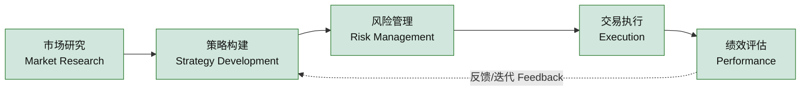
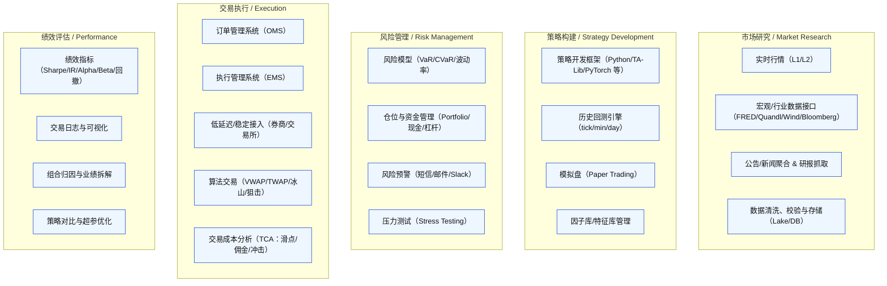

# 量化交易平台：交易员工作流和软件架构

---

## 一、股票交易员的一级工作流程（宏观维度）

我们可以把交易员的工作流程拆解为五个主要环节：

1. **市场研究与信息获取**
   - 获取行情、宏观数据、行业数据、个股基本面信息
   - 追踪新闻、政策、公司公告、研究报告
2. **交易策略构建与验证**
   - 确定交易思路（基本面、技术面、事件驱动、因子模型等）
   - 编写/优化量化策略
   - 回测（历史数据验证策略有效性）
   - 模拟交易（在虚拟环境中测试实盘表现）
3. **风险管理与资金配置**
   - 资金分配、仓位控制
   - 风险监控（VaR、最大回撤、相关性、波动率）
   - 止损止盈机制设计
4. **交易执行与监控**
   - 策略信号实时触发
   - 订单执行（低延迟交易、算法撮合、分批成交）
   - 交易成本控制（滑点、佣金、冲击成本）
   - 实时监控交易结果和市场反馈
5. **绩效评估与迭代优化**
   - 交易结果分析（收益率、Sharpe、信息比率、胜率）
   - 策略有效性复盘
   - 组合绩效评估
   - 策略迭代与优化

---

## 二、量化交易平台在各环节的功能拆解

| 一级流程 交易员需求 平台功能 |             |                                                                                                                          |
| --------------- | ----------- | ------------------------------------------------------------------------------------------------------------------------ |
| **市场研究**        | 快速获取多维度数据   | - 实时行情（Level-1/Level-2）- 宏观&行业数据接口（FRED, Quandl, Wind, Bloomberg 等）- 新闻与公告爬取/聚合- 数据清洗与存储（Data Lake / DB）                 |
| **策略构建**        | 高效实现并验证策略   | - 策略开发框架（Python/Java/C++，支持量化库，如 Pandas, TA-Lib, PyTorch）- 历史数据回测引擎（支持 tick/day/minute 级回测）- 模拟盘（Paper Trading，支持实时行情仿真） |
| **风险管理**        | 控制风险，保证稳健性  | - 风险模型模块（VaR、CVaR、波动率预测）- 仓位与资金管理工具- 风险警报系统（短信/邮件/Slack）- 压力测试工具（Stress Testing）                                         |
| **交易执行**        | 快速下单，降低成本   | - 订单管理系统（OMS）- 执行管理系统（EMS）- 高频/低延迟交易接口- 智能算法交易（TWAP/VWAP、冰山单、狙击单）- 成本分析模块（Transaction Cost Analysis, TCA）                |
| **绩效评估**        | 衡量策略效果，迭代优化 | - 策略绩效分析（Sharpe, Alpha, Beta, IR, 最大回撤）- 交易日志与统计可视化- 组合管理与归因分析- 策略对比与优化工具                                                |

---

## 三、简要总结

一个交易员的工作流可以被映射为：\
**数据 → 策略 → 风险 → 执行 → 评估 → 迭代**。

量化交易平台如果想真正服务于交易员，就需要覆盖：

- **数据层**（全、快、干净）
- **研究层**（策略开发、回测、模拟）
- **风险层**（风控、资金管理）
- **执行层**（低延迟、智能交易）
- **分析层**（绩效复盘、组合分析）

---

## 1) 交易员一级工作流程

---

## 2) 各环节 → 平台功能模块映射

---

