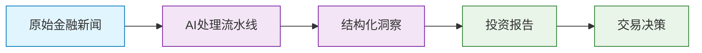
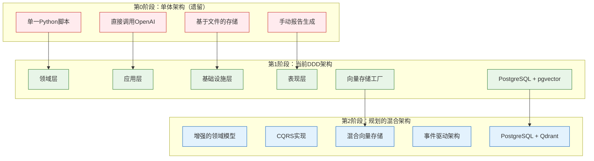
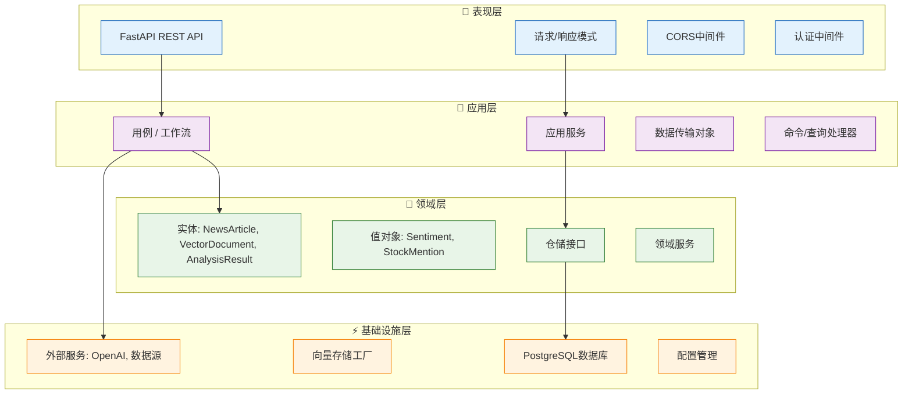
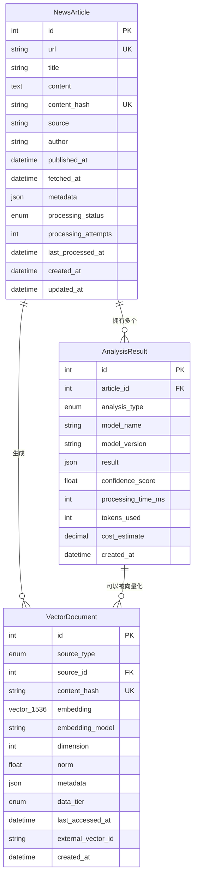
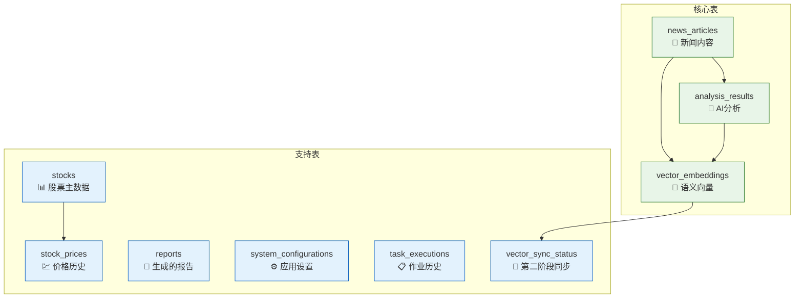
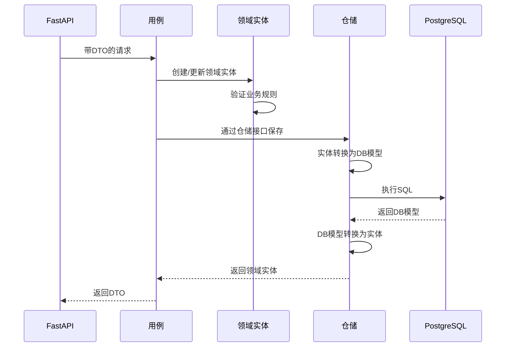
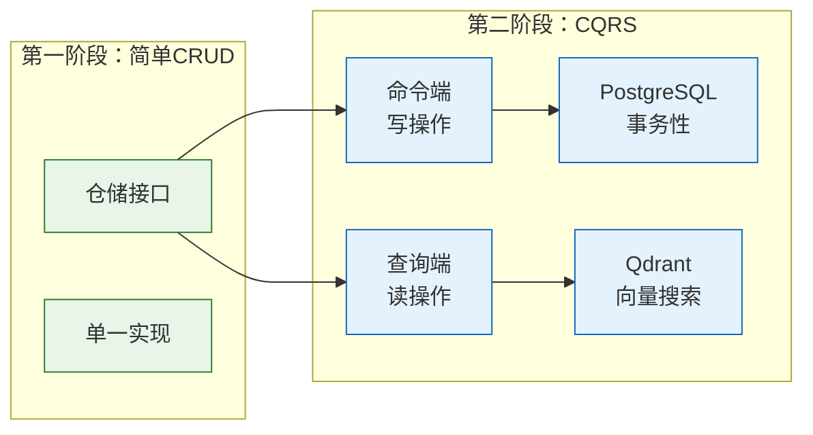
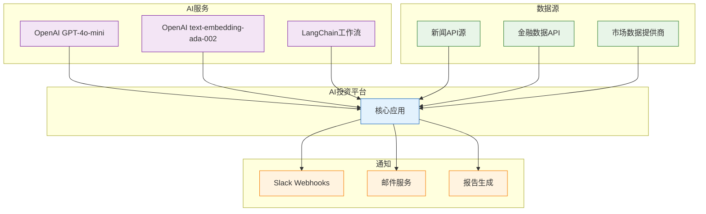

# AI 投资趋势 - 系统架构文档

## 📋 目录

1. [系统概述](#系统概述)
2. [架构演进](#架构演进)
3. [分层架构设计](#分层架构设计)
4. [数据模型](#数据模型)
5. [核心架构模式](#核心架构模式)
6. [技术栈](#技术栈)
7. [架构决策记录](#架构决策记录)
8. [第二阶段准备](#第二阶段准备)

---

## 🎯 系统概述

AI 投资趋势是一个智能投资研究自动化平台，通过AI驱动的分析和向量相似度搜索，将金融新闻和市场数据转化为可操作的投资洞察。

### 核心能力

- **🔍 智能新闻处理**：自动化新闻获取、内容提取和去重
- **🤖 AI驱动分析**：使用OpenAI模型进行多维度内容分析（情感分析、主题提取、股票提及、趋势分析）
- **🎯 向量相似度搜索**：使用PostgreSQL + pgvector实现高性能语义搜索
- **📊 投资报告生成**：自动生成包含市场洞察的投资报告
- **🚀 可扩展架构**：基于领域驱动设计，为混合向量存储做好准备

### 业务价值



---

## 🏗️ 架构演进

### 从单体架构到领域驱动设计

系统已从单体架构演进为现代化的分层DDD架构，以支持可扩展性、可维护性和未来增强。



### 关键架构改进

| 方面 | 单体架构 | 当前DDD | 未来混合 |
|--------|------------|-------------|---------------|
| **可维护性** | 低 | 高 | 非常高 |
| **可测试性** | 困难 | 容易 | 全面 |
| **可扩展性** | 有限 | 良好 | 优秀 |
| **向量搜索** | 无 | PostgreSQL+pgvector | 混合存储 |
| **领域逻辑** | 分散 | 集中化 | 事件驱动 |

---

## 🏛️ 分层架构设计

系统遵循领域驱动设计（DDD）原则，在四个不同层级之间明确分离关注点。



### 📁 目录结构

```
src/
├── domain/                 # 🏢 领域层 - 核心业务逻辑
│   ├── entities/           # 业务实体
│   ├── repositories/       # 仓储接口
│   └── value_objects/      # 不可变值对象
├── application/            # 💼 应用层 - 用例
│   ├── use_cases/          # 业务工作流
│   ├── services/           # 应用服务
│   └── dtos/               # 数据传输对象
├── infrastructure/         # ⚡ 基础设施层 - 外部关注点
│   ├── database/           # PostgreSQL + SQLAlchemy
│   ├── external/           # 外部服务集成
│   └── config/             # 配置管理
└── presentation/           # 🎨 表现层 - API接口
    ├── api/                # FastAPI路由
    ├── schemas/            # 请求/响应模型
    └── middleware/         # 横切关注点
```

### 层级职责

#### 🏢 领域层 (`src/domain/`)
**目的**：包含不依赖外部系统的纯业务逻辑

**组件**:
- **实体** (`entities/`)：具有身份和生命周期的核心业务对象
  - `NewsArticle`：表示具有处理状态的金融新闻
  - `VectorDocument`：表示用于相似度搜索的向量化内容  
  - `AnalysisResult`：表示AI分析输出
- **值对象** (`value_objects/`)：表示业务概念的不可变对象
  - `Sentiment`：带置信度的情感分析结果
  - `StockMention`：带上下文的股票符号提及
- **仓储接口** (`repositories/`)：数据访问抽象
  - `NewsRepository`：新闻文章数据访问合约
  - `VectorRepository`：多后端支持的向量存储抽象
  - `AnalysisRepository`：分析结果数据管理

**关键原则**:
- 不依赖外部框架
- 具有业务行为的丰富领域对象
- 数据完整性的不可变值对象
- 基础设施独立的抽象接口

#### 💼 应用层 (`src/application/`)
**目的**：编排业务工作流并协调各层之间的交互

**组件**:
- **用例** (`use_cases/`)：业务工作流实现
  - `TestVectorStorageUseCase`：向量存储功能测试
  - 未来：`NewsProcessingUseCase`、`ReportGenerationUseCase`
- **服务** (`services/`)：应用特定的业务逻辑
- **DTOs** (`dtos/`)：跨层通信的数据传输对象

**关键原则**:
- 编排领域对象以实现业务用例
- 管理事务并协调仓储之间的操作
- 在表现层和领域层之间转换数据
- 不包含业务规则（委托给领域层）

#### ⚡ 基础设施层 (`src/infrastructure/`)
**目的**：实现技术关注点和外部集成

**组件**:
- **数据库** (`database/`)：
  - `models.py`：SQLAlchemy ORM模型
  - `connection.py`：数据库连接管理
  - `repositories/`：具体仓储实现
- **外部服务** (`external/`)：
  - `openai/`：AI分析服务集成
  - `data_sources/`：新闻和市场数据获取器
  - `notifications/`：Slack和报告投递
- **配置** (`config/`)：
  - `vector_storage_factory.py`：可插拔向量存储后端
  - `settings.py`：应用配置管理

**关键原则**:
- 实现领域仓储接口
- 管理外部服务集成
- 处理基础设施关注点（数据库、API、文件系统）
- 提供配置和依赖注入

#### 🎨 表现层 (`src/presentation/`)
**目的**：处理HTTP通信和API契约

**组件**:
- **API** (`api/`)：FastAPI路由处理器
- **模式** (`schemas/`)：请求/响应验证模型
- **中间件** (`middleware/`)：横切关注点（认证、日志、CORS）

**关键原则**:
- 将HTTP请求转换为应用用例
- 验证输入并格式化输出
- 处理HTTP特定关注点（状态码、头部）
- 维护API契约和版本控制

---

## 📊 数据模型

### 领域数据模型

领域层定义了捕获投资研究领域基本概念的纯业务对象。



#### 📰 NewsArticle 实体

**目的**：表示具有处理生命周期管理的金融新闻文章

**关键属性**:
```python
@dataclass
class NewsArticle:
    # 核心内容
    url: str                           # 唯一文章URL
    title: str                         # 文章标题
    content: str                       # 完整文章文本
    content_hash: str                  # 用于去重的SHA-256
    source: str                        # 新闻提供商（路透社、彭博社等）
    
    # 发布信息  
    author: Optional[str]              # 文章作者
    published_at: Optional[datetime]   # 原始发布时间
    fetched_at: Optional[datetime]     # 我们获取的时间
    
    # 处理生命周期
    processing_status: ProcessingStatus # pending/processing/completed/failed
    processing_attempts: int            # 重试计数器
    last_processed_at: Optional[datetime] # 最后处理尝试时间
    
    # 灵活数据
    metadata: Dict[str, Any]           # 额外结构化数据
```

**业务行为**:
- `mark_processing_started()`：跟踪处理尝试
- `mark_processing_completed()`：成功时更新状态
- `should_retry_processing()`：确定重试资格
- `get_content_snippet()`：返回截断的内容预览

#### 🎯 VectorDocument 实体

**目的**：表示转换为向量嵌入以进行语义搜索的内容

**关键属性**:
```python  
@dataclass
class VectorDocument:
    # 向量核心
    source_type: VectorSourceType      # news_article/analysis_result/market_data
    source_id: int                     # 引用源实体
    content_hash: str                  # 链接到原始内容
    embedding: List[float]             # 1536维OpenAI嵌入
    embedding_model: str               # "text-embedding-ada-002"
    
    # 向量属性
    dimension: Optional[int]           # 嵌入维度（1536）
    norm: Optional[float]              # 性能缓存的L2范数
    
    # 数据生命周期（第二阶段准备）
    data_tier: DataTier                # hot/warm/cold存储策略
    last_accessed_at: Optional[datetime] # 用于层级迁移决策
    external_vector_id: Optional[str]   # 混合存储的Qdrant/Pinecone ID
    
    # 元数据
    metadata: Dict[str, Any]           # 源上下文和属性
```

**业务行为**:
- `cosine_similarity()`：计算与其他向量的相似度
- `normalize_vector()`：返回单位向量
- `should_migrate_to_cold()`：确定存储层级迁移
- `update_access_time()`：跟踪生命周期管理的使用情况

#### 📈 AnalysisResult 实体

**目的**：存储带有性能指标的AI驱动分析输出

**关键属性**:
```python
@dataclass  
class AnalysisResult:
    # 分析核心
    article_id: int                    # 源文章引用
    analysis_type: AnalysisType        # topic_extraction/sentiment/stock_mention/等
    model_name: str                    # "gpt-4o-mini"
    result: Dict[str, Any]             # 灵活的分析输出结构
    
    # 模型性能
    confidence_score: Optional[float]  # 模型置信度（0.0-1.0）
    processing_time_ms: Optional[int]  # 执行持续时间
    tokens_used: Optional[int]         # OpenAI令牌消费
    cost_estimate: Optional[float]     # 估计API成本
    
    # 版本控制  
    model_version: Optional[str]       # 可重现性的模型版本
```

**业务行为**:
- `topics`：从分析结果中提取主题列表
- `sentiment`：获取情感分类
- `stocks_mentioned`：返回提及的股票符号
- `is_high_confidence()`：检查分析是否达到质量阈值

### 基础设施数据模型

基础设施层将这些领域概念实现为带有性能优化的PostgreSQL表。

#### 🗃️ 数据库模式设计



#### 📋 表规格说明

**news_articles** - 核心新闻内容存储
```sql
CREATE TABLE news_articles (
    id                    BIGSERIAL PRIMARY KEY,
    url                   VARCHAR(1000) UNIQUE NOT NULL,
    title                 VARCHAR(500) NOT NULL,  
    content               TEXT,
    content_hash          VARCHAR(64) UNIQUE NOT NULL,
    source                VARCHAR(100) NOT NULL,
    author                VARCHAR(200),
    published_at          TIMESTAMP,
    fetched_at            TIMESTAMP DEFAULT NOW(),
    article_metadata      JSONB DEFAULT '{}',
    processing_status     VARCHAR(20) DEFAULT 'pending',
    processing_attempts   INTEGER DEFAULT 0,
    last_processed_at     TIMESTAMP,
    created_at            TIMESTAMP DEFAULT NOW(),
    updated_at            TIMESTAMP DEFAULT NOW()
);

-- 性能索引
CREATE INDEX idx_news_published_at ON news_articles(published_at);
CREATE INDEX idx_news_source_published ON news_articles(source, published_at);  
CREATE INDEX idx_news_metadata_gin ON news_articles USING gin(article_metadata);
```

**vector_embeddings** - 使用pgvector的高性能向量存储
```sql
CREATE TABLE vector_embeddings (
    id                    BIGSERIAL PRIMARY KEY,
    source_type           VARCHAR(50) NOT NULL,      -- 'news_article', 'analysis_result'
    source_id             BIGINT NOT NULL,           -- 引用源实体
    content_hash          VARCHAR(64) NOT NULL,
    embedding             VECTOR(1536),              -- OpenAI嵌入维度
    embedding_model       VARCHAR(100) DEFAULT 'text-embedding-ada-002',
    dimension             INTEGER NOT NULL DEFAULT 1536,
    norm                  DECIMAL(10,6),             -- 缓存的L2范数
    vector_metadata       JSONB DEFAULT '{}',
    data_tier             VARCHAR(10) DEFAULT 'hot', -- 'hot'/'warm'/'cold'
    last_accessed_at      TIMESTAMP DEFAULT NOW(),
    external_vector_id    VARCHAR(100),              -- 第二阶段：Qdrant/Pinecone ID
    created_at            TIMESTAMP DEFAULT NOW()
);

-- 向量相似度搜索优化  
CREATE INDEX idx_vector_embedding_hnsw ON vector_embeddings 
USING hnsw (embedding vector_cosine_ops) 
WITH (m = 16, ef_construction = 64);

-- 过滤的复合索引
CREATE INDEX idx_vector_source ON vector_embeddings(source_type, source_id);
CREATE UNIQUE INDEX idx_vector_unique ON vector_embeddings(content_hash, embedding_model);
```

**analysis_results** - 带性能跟踪的AI分析输出
```sql
CREATE TABLE analysis_results (
    id                    BIGSERIAL PRIMARY KEY,
    article_id            BIGINT NOT NULL REFERENCES news_articles(id) ON DELETE CASCADE,
    analysis_type         VARCHAR(50) NOT NULL,      -- 'topic_extraction', 'sentiment', 等
    model_name            VARCHAR(100) NOT NULL,     -- 'gpt-4o-mini'
    model_version         VARCHAR(50),
    result                JSONB NOT NULL,            -- 灵活的分析输出
    processing_time_ms    INTEGER,
    tokens_used           INTEGER,
    cost_estimate         DECIMAL(10,6),
    confidence_score      DECIMAL(3,2),              -- 0.00 to 1.00
    created_at            TIMESTAMP DEFAULT NOW()
);

-- 查询优化索引
CREATE INDEX idx_analysis_article_type ON analysis_results(article_id, analysis_type);
CREATE INDEX idx_analysis_model_created ON analysis_results(model_name, created_at);
CREATE INDEX idx_analysis_result_gin ON analysis_results USING gin(result);
```

#### 🔄 数据流转和转换



**转换层级**:
1. **API模式 ↔ DTO**：输入验证和输出格式化
2. **DTO ↔ 领域实体**：应用层协调  
3. **领域实体 ↔ 数据库模型**：基础设施持久化
4. **数据库模型 ↔ 向量存储**：专门的向量操作

---

## 🎯 核心架构模式

### 仓储模式

**目的**：领域逻辑和数据持久化之间的抽象层

**实现**:
```python
# 领域接口 (src/domain/repositories/vector_repository.py)
class VectorRepository(ABC):
    @abstractmethod
    async def similarity_search(
        self, 
        query_vector: List[float], 
        top_k: int = 10
    ) -> List[SearchResult]:
        pass

# 基础设施实现 (src/infrastructure/database/repositories/)
class PostgreSQLVectorRepository(VectorRepository):
    async def similarity_search(self, query_vector: List[float], top_k: int) -> List[SearchResult]:
        # PostgreSQL + pgvector 实现
        stmt = (
            select(VectorEmbedding, VectorEmbedding.embedding.cosine_distance(query_vector))
            .order_by(VectorEmbedding.embedding.cosine_distance(query_vector))
            .limit(top_k)
        )
        # ... 实现细节
```

**优势**:
- 领域层保持独立于数据存储技术
- 第二阶段可轻松在PostgreSQL和Qdrant之间切换
- 使用模拟仓储简化单元测试
- 业务逻辑与持久化关注点的清晰分离

### 工厂模式

**目的**：向量存储后端的可插拔架构

**实现**:
```python
# 工厂 (src/infrastructure/config/vector_storage_factory.py)
class VectorStorageFactory:
    def create_repository(self) -> VectorRepository:
        provider = os.getenv("VECTOR_STORAGE_PROVIDER", "postgresql")
        
        if provider == "postgresql":
            return PostgreSQLVectorRepository()
        elif provider == "qdrant":  # 第二阶段
            return QdrantVectorRepository()
        else:
            raise ValueError(f"不支持的提供商: {provider}")

# 在应用层中的使用
vector_storage_factory = VectorStorageFactory()
repository = vector_storage_factory.create_repository()
```

**优势**:
- 基于环境的后端切换
- 迁移存储后端时无需代码更改
- 不同向量数据库之间的一致接口
- 易于添加新的向量存储提供商

### 领域驱动设计聚合

**目的**：一致性边界和事务完整性

**设计**:
```python
# NewsArticle 作为聚合根
class NewsArticle:
    def process_with_ai(self, analyzer: AIAnalyzer) -> AnalysisResult:
        """维持一致性的业务操作"""
        if not self.is_ready_for_processing():
            raise DomainException("文章尚未准备好处理")
        
        self.mark_processing_started()
        result = analyzer.analyze(self.content)
        self.mark_processing_completed()
        
        return result

# VectorDocument 作为独立聚合  
class VectorDocument:
    def calculate_similarity(self, other: 'VectorDocument') -> float:
        """带业务逻辑的领域操作"""
        if self.dimension != other.dimension:
            raise DomainException("维度不匹配")
        
        return self.cosine_similarity(other.embedding)
```

### CQRS准备（第二阶段）

**当前状态**：简单仓储模式
**第二阶段目标**：命令查询职责分离



---

## 🛠️ 技术栈

### 核心技术

| 层级 | 技术 | 用途 | 版本 |
|-------|------------|---------|---------|
| **API** | FastAPI | 异步web框架 | ≥0.104.0 |
| **ORM** | SQLAlchemy | 带异步支持的数据库ORM | ≥2.0.0 |
| **数据库** | PostgreSQL | 主要数据存储 | ≥15.0 |
| **向量** | pgvector | 向量相似度搜索 | ≥0.2.0 |
| **AI** | OpenAI | 分析语言模型 | ≥1.86.0 |
| **编排** | LangChain | LLM工作流管理 | ≥0.3.17 |

### 开发与运维

| 类别 | 技术 | 用途 |
|----------|------------|---------|
| **测试** | pytest | 单元和集成测试 |
| **类型检查** | mypy | 静态类型验证 |
| **容器化** | Docker | 开发和部署 |
| **环境** | python-dotenv | 配置管理 |
| **日志** | structlog | 结构化应用日志 |
| **监控** | 自定义健康检查 | 系统健康监控 |

### 外部集成



### 性能特征

| 组件 | 性能目标 | 测量方式 |
|-----------|-------------------|-------------|
| **向量搜索** | < 50ms获取前10个结果 | pgvector HNSW索引 |
| **AI分析** | < 5s每篇文章 | OpenAI API延迟 |
| **数据库查询** | < 100ms复杂连接 | PostgreSQL优化 |
| **API响应** | < 200ms标准请求 | FastAPI异步性能 |
| **内存使用** | < 2GB标准工作负载 | Python内存管理 |

---

## 🤔 架构决策记录

### ADR-001：PostgreSQL + pgvector 而非专用向量数据库

**状态**：已接受 ✅

**背景**： 
需要向量相似度搜索功能进行金融新闻的语义分析。

**决策**： 
使用带pgvector扩展的PostgreSQL，而非专用向量数据库（Pinecone、Weaviate、Qdrant）。

**理由**:
- **运维简单性**：管理单一数据库而非多个系统
- **ACID合规**：关系型和向量数据间的事务一致性
- **成本效益**：向量操作无需额外基础设施或API成本
- **性能充分**：pgvector HNSW索引在我们的规模下提供足够性能
- **生态集成**：与现有SQLAlchemy ORM无缝集成

**后果**:
- ✅ 降低运维复杂性
- ✅ 更低的基础设施成本  
- ✅ 一致的备份和恢复程序
- ❌ 在大规模（>1000万向量）时潜在性能限制
- ❌ 较少的专门向量操作功能

**第二阶段迁移路径**： 
混合方法，PostgreSQL用于元数据，Qdrant用于向量操作。

### ADR-002：领域驱动设计架构

**状态**：已接受 ✅

**背景**： 
随着业务复杂性增长，之前的单体架构变得难以维护和测试。

**决策**： 
实现遵循领域驱动设计原则的分层架构。

**理由**:
- **业务专注**：领域层捕获复杂的金融分析规则
- **可测试性**：清晰分离支持隔离单元测试
- **可维护性**：每层都有单一职责
- **可扩展性**：易于添加新的分析类型和数据源
- **团队协作**：不同开发角色的清晰边界

**后果**:
- ✅ 改善代码组织和可维护性
- ✅ 更好的业务和技术关注点分离
- ✅ 增强可测试性和开发速度
- ❌ 增加初始开发复杂性
- ❌ 对不熟悉DDD的开发人员有学习曲线

### ADR-003：异步优先架构

**状态**：已接受 ✅

**背景**： 
需要高效处理多个并发AI API调用和数据库操作。

**决策**： 
在整个应用栈中使用async/await（FastAPI、SQLAlchemy async、asyncio）。

**理由**:
- **I/O密集型工作负载**：大多数操作涉及网络调用（OpenAI API、数据库）
- **并发性**：同时处理多篇新闻文章
- **资源效率**：I/O等待期间更好的CPU利用率
- **可扩展性**：用相同硬件处理更高请求量

**后果**:
- ✅ 改善吞吐量和响应性
- ✅ 更好的资源利用
- ✅ 并发处理的可扩展架构
- ❌ async/await模式增加代码复杂性
- ❌ 异步上下文中的调试复杂性

### ADR-004：向量存储的工厂模式

**状态**：已接受 ✅

**背景**： 
需要在不更改代码的情况下在不同向量存储后端之间切换的能力。

**决策**： 
为向量存储提供商实现基于环境配置的工厂模式。

**理由**:
- **灵活性**：向专用向量数据库的简易迁移路径
- **测试**：单元测试的简单模拟
- **环境对等**：开发、演示、生产的不同后端
- **供应商独立**：避免锁定特定向量数据库供应商

**后果**:
- ✅ 第二阶段混合架构的清洁迁移路径
- ✅ 简化测试和开发工作流  
- ✅ 配置驱动的后端选择
- ❌ 额外的抽象层复杂性
- ❌ 接口必须适应最小公分母功能

---

## 🚀 第二阶段准备

### 混合向量存储策略

**当前状态（第一阶段）**:
- 带pgvector的单一PostgreSQL数据库
- 通过仓储接口的所有向量操作
- 配置驱动的后端选择

**未来状态（第二阶段）**:
- 混合PostgreSQL + Qdrant架构
- 读写分离的CQRS模式
- 事件驱动同步

```mermaid
graph TB
    subgraph "第二阶段：混合架构"
        subgraph "命令端（写入）"
            C1[新闻处理]
            C2[PostgreSQL主数据库]
            C3[事务数据]
        end
        
        subgraph "查询端（读取）"  
            Q1[向量搜索]
            Q2[Qdrant集群]
            Q3[优化向量]
        end
        
        subgraph "同步"
            S1[事件总线]
            S2[向量同步作业]
            S3[一致性监控]
        end
    end
    
    C1 --> C2
    C2 --> S1
    S1 --> S2
    S2 --> Q2
    Q1 --> Q2
    
    classDef write fill:#ffebee,stroke:#c62828
    classDef read fill:#e8f5e8,stroke:#2e7d32
    classDef sync fill:#fff3e0,stroke:#f57c00
    
    class C1,C2,C3 write
    class Q1,Q2,Q3 read  
    class S1,S2,S3 sync
```

### 迁移策略

#### 第二阶段 2.1：双写实现
```python
class HybridVectorRepository(VectorRepository):
    def __init__(self):
        self.postgresql_repo = PostgreSQLVectorRepository()
        self.qdrant_repo = QdrantVectorRepository()
        
    async def insert_vector(self, document: VectorDocument) -> str:
        # 写入主数据库（PostgreSQL）
        primary_id = await self.postgresql_repo.insert_vector(document)
        
        # 异步写入次数据库（Qdrant）  
        await self._sync_to_qdrant(document, primary_id)
        
        return primary_id
        
    async def similarity_search(self, query_vector: List[float], top_k: int) -> List[SearchResult]:
        # 从优化的向量数据库读取（Qdrant）
        return await self.qdrant_repo.similarity_search(query_vector, top_k)
```

#### 第二阶段 2.2：事件驱动同步
```python
class VectorSyncService:
    async def handle_vector_created_event(self, event: VectorCreatedEvent):
        """向量创建事件的异步同步处理器"""
        try:
            await self.qdrant_client.upsert_vector(
                vector_id=event.vector_id,
                embedding=event.embedding,
                metadata=event.metadata
            )
            await self.mark_sync_completed(event.vector_id)
        except Exception as e:
            await self.handle_sync_failure(event.vector_id, str(e))
```

#### 第二阶段 2.3：渐进式迁移
1. **准备**（当前）：工厂模式和抽象接口
2. **双写**：同时写入PostgreSQL和Qdrant
3. **读取迁移**：逐渐将读取转移到Qdrant  
4. **验证**：比较两个系统之间的结果
5. **完全迁移**：移除PostgreSQL向量操作
6. **清理**：移除旧的向量列和索引

### 未来增强

#### 高级向量操作
```python
# 第二阶段增强向量仓储接口
class AdvancedVectorRepository(VectorRepository):
    async def hybrid_search(
        self,
        query_vector: List[float],
        filters: Dict[str, Any],
        alpha: float = 0.5  # 混合搜索权重
    ) -> List[SearchResult]:
        """结合向量相似度与传统过滤"""
        pass
    
    async def vector_clustering(
        self,
        vectors: List[str],
        num_clusters: int
    ) -> Dict[str, List[str]]:
        """将相似向量分组为集群"""
        pass
    
    async def anomaly_detection(
        self,
        baseline_vectors: List[str],
        candidate_vector: str,
        threshold: float
    ) -> bool:
        """检测向量空间中的异常模式"""
        pass
```

#### 事件驱动架构
```python  
class NewsProcessingWorkflow:
    async def process_news_article(self, article: NewsArticle):
        """事件驱动的新闻处理流水线"""
        # 为每个处理步骤发出领域事件
        await self.event_bus.publish(ArticleFetchedEvent(article.id))
        
        analysis_result = await self.ai_analyzer.analyze(article)
        await self.event_bus.publish(ArticleAnalyzedEvent(article.id, analysis_result))
        
        vector_doc = await self.vectorizer.create_embedding(article)
        await self.event_bus.publish(VectorCreatedEvent(vector_doc.id))
        
        await self.event_bus.publish(ProcessingCompletedEvent(article.id))
```

### 性能和可扩展性目标

| 指标 | 第一阶段现状 | 第二阶段目标 | 扩展策略 |
|--------|-----------------|-----------------|------------------|
| **向量搜索** | 50ms @ 10万向量 | 10ms @ 1000万向量 | Qdrant集群 + HNSW优化 |
| **并发用户** | 10个同时用户 | 100+个同时用户 | API水平扩展 |
| **文章处理** | 10篇文章/分钟 | 1000篇文章/分钟 | 事件驱动流水线 |
| **数据存储** | 10GB总计 | 1TB+总计 | 分层存储策略 |
| **系统可用性** | 99.0%正常运行 | 99.9%正常运行 | 多区域部署 |

---

## 📚 参考资料和扩展阅读

### 领域驱动设计
- Evans, Eric. 《领域驱动设计：软件核心复杂性应对之道》
- Vernon, Vaughn. 《实现领域驱动设计》

### 向量数据库和相似度搜索  
- [pgvector 文档](https://github.com/pgvector/pgvector)
- [Qdrant 向量数据库](https://qdrant.tech/)
- [OpenAI 嵌入指南](https://platform.openai.com/docs/guides/embeddings)

### FastAPI和异步Python
- [FastAPI 文档](https://fastapi.tiangolo.com/)
- [SQLAlchemy 异步文档](https://docs.sqlalchemy.org/en/20/orm/extensions/asyncio.html)

### 金融数据处理
- [金融应用的LangChain](https://langchain.com/)
- [Python量化金融](https://www.quantstart.com/)

---

*此架构文档与代码库一起维护，并在每次重大架构决策或系统演进时更新。*