# AI Invest Trend - System Architecture Documentation

## 📋 Table of Contents

1. [System Overview](#system-overview)
2. [Architecture Evolution](#architecture-evolution)
3. [Layered Architecture Design](#layered-architecture-design)
4. [Data Models](#data-models)
5. [Core Architectural Patterns](#core-architectural-patterns)
6. [Technology Stack](#technology-stack)
7. [Architecture Decision Records](#architecture-decision-records)
8. [Phase 2 Preparation](#phase-2-preparation)

---

## 🎯 System Overview

AI Invest Trend is an intelligent investment research automation platform that transforms financial news and market data into actionable investment insights through AI-powered analysis and vector similarity search.

### Core Capabilities

- **🔍 Intelligent News Processing**: Automated news fetching, content extraction, and deduplication
- **🤖 AI-Powered Analysis**: Multi-dimensional content analysis using OpenAI models (sentiment, topic extraction, stock mentions, trend analysis)
- **🎯 Vector Similarity Search**: High-performance semantic search using PostgreSQL + pgvector
- **📊 Investment Report Generation**: Automated report compilation with market insights
- **🚀 Scalable Architecture**: Domain-driven design with preparation for hybrid vector storage

### Business Value


---

## 🏗️ Architecture Evolution

### From Monolithic to Domain-Driven Design

The system has evolved from a monolithic architecture to a modern, layered DDD architecture to support scalability, maintainability, and future enhancements.


### Key Architectural Improvements

| Aspect | Monolithic | Current DDD | Future Hybrid |
|--------|------------|-------------|---------------|
| **Maintainability** | Low | High | Very High |
| **Testability** | Difficult | Easy | Comprehensive |
| **Scalability** | Limited | Good | Excellent |
| **Vector Search** | None | PostgreSQL+pgvector | Hybrid Storage |
| **Domain Logic** | Scattered | Centralized | Event-Driven |

---

## 🏛️ Layered Architecture Design

The system follows Domain-Driven Design (DDD) principles with clear separation of concerns across four distinct layers.


### 📁 Directory Structure

```
src/
├── domain/                 # 🏢 Domain Layer - Core Business Logic
│   ├── entities/           # Business Entities
│   ├── repositories/       # Repository Interfaces
│   └── value_objects/      # Immutable Value Objects
├── application/            # 💼 Application Layer - Use Cases
│   ├── use_cases/          # Business Workflows
│   ├── services/           # Application Services
│   └── dtos/               # Data Transfer Objects
├── infrastructure/         # ⚡ Infrastructure Layer - External Concerns
│   ├── database/           # PostgreSQL + SQLAlchemy
│   ├── external/           # External Service Integrations
│   └── config/             # Configuration Management
└── presentation/           # 🎨 Presentation Layer - API Interface
    ├── api/                # FastAPI Routes
    ├── schemas/            # Request/Response Models
    └── middleware/         # Cross-cutting Concerns
```

### Layer Responsibilities

#### 🏢 Domain Layer (`src/domain/`)
**Purpose**: Contains pure business logic without external dependencies

**Components**:
- **Entities** (`entities/`): Core business objects with identity and lifecycle
  - `NewsArticle`: Represents financial news with processing status
  - `VectorDocument`: Represents vectorized content for similarity search  
  - `AnalysisResult`: Represents AI analysis outputs
- **Value Objects** (`value_objects/`): Immutable objects representing business concepts
  - `Sentiment`: Sentiment analysis results with confidence scores
  - `StockMention`: Stock symbol mentions with context
- **Repository Interfaces** (`repositories/`): Data access abstractions
  - `NewsRepository`: News article data access contract
  - `VectorRepository`: Vector storage abstraction for multi-backend support
  - `AnalysisRepository`: Analysis result data management

**Key Principles**:
- No dependencies on external frameworks
- Rich domain objects with business behavior
- Immutable value objects for data integrity
- Abstract interfaces for infrastructure independence

#### 💼 Application Layer (`src/application/`)
**Purpose**: Orchestrates business workflows and coordinates between layers

**Components**:
- **Use Cases** (`use_cases/`): Business workflow implementations
  - `TestVectorStorageUseCase`: Vector storage functionality testing
  - Future: `NewsProcessingUseCase`, `ReportGenerationUseCase`
- **Services** (`services/`): Application-specific business logic
- **DTOs** (`dtos/`): Data transfer objects for cross-layer communication

**Key Principles**:
- Orchestrates domain objects to fulfill business use cases
- Manages transactions and coordinates between repositories
- Transforms data between presentation and domain layers
- Contains no business rules (delegated to domain layer)

#### ⚡ Infrastructure Layer (`src/infrastructure/`)
**Purpose**: Implements technical concerns and external integrations

**Components**:
- **Database** (`database/`):
  - `models.py`: SQLAlchemy ORM models
  - `connection.py`: Database connection management
  - `repositories/`: Concrete repository implementations
- **External Services** (`external/`):
  - `openai/`: AI analysis service integrations
  - `data_sources/`: News and market data fetchers
  - `notifications/`: Slack and report delivery
- **Configuration** (`config/`):
  - `vector_storage_factory.py`: Pluggable vector storage backends
  - `settings.py`: Application configuration management

**Key Principles**:
- Implements domain repository interfaces
- Manages external service integrations
- Handles infrastructure concerns (databases, APIs, file systems)
- Provides configuration and dependency injection

#### 🎨 Presentation Layer (`src/presentation/`)
**Purpose**: Handles HTTP communication and API contracts

**Components**:
- **API** (`api/`): FastAPI route handlers
- **Schemas** (`schemas/`): Request/response validation models
- **Middleware** (`middleware/`): Cross-cutting concerns (auth, logging, CORS)

**Key Principles**:
- Translates HTTP requests to application use cases
- Validates input and formats output
- Handles HTTP-specific concerns (status codes, headers)
- Maintains API contracts and versioning

---

## 📊 Data Models

### Domain Data Models

The domain layer defines pure business objects that capture the essential concepts of the investment research domain.


#### 📰 NewsArticle Entity

**Purpose**: Represents a financial news article with processing lifecycle management

**Key Attributes**:
```python
@dataclass
class NewsArticle:
    # Core Content
    url: str                           # Unique article URL
    title: str                         # Article headline
    content: str                       # Full article text
    content_hash: str                  # SHA-256 for deduplication
    source: str                        # News provider (Reuters, Bloomberg, etc.)
    
    # Publication Info  
    author: Optional[str]              # Article author
    published_at: Optional[datetime]   # Original publication time
    fetched_at: Optional[datetime]     # When we retrieved it
    
    # Processing Lifecycle
    processing_status: ProcessingStatus # pending/processing/completed/failed
    processing_attempts: int            # Retry counter
    last_processed_at: Optional[datetime] # Last processing attempt
    
    # Flexible Data
    metadata: Dict[str, Any]           # Additional structured data
```

**Business Behaviors**:
- `mark_processing_started()`: Tracks processing attempts
- `mark_processing_completed()`: Updates status on success
- `should_retry_processing()`: Determines retry eligibility
- `get_content_snippet()`: Returns truncated content preview

#### 🎯 VectorDocument Entity

**Purpose**: Represents content transformed into vector embeddings for semantic search

**Key Attributes**:
```python  
@dataclass
class VectorDocument:
    # Vector Core
    source_type: VectorSourceType      # news_article/analysis_result/market_data
    source_id: int                     # References source entity
    content_hash: str                  # Links to original content
    embedding: List[float]             # 1536-dimensional OpenAI embedding
    embedding_model: str               # "text-embedding-ada-002"
    
    # Vector Properties
    dimension: Optional[int]           # Embedding dimensionality (1536)
    norm: Optional[float]              # Cached L2 norm for performance
    
    # Data Lifecycle (Phase 2 Preparation)
    data_tier: DataTier                # hot/warm/cold storage strategy
    last_accessed_at: Optional[datetime] # For tier migration decisions
    external_vector_id: Optional[str]   # Qdrant/Pinecone ID for hybrid storage
    
    # Metadata
    metadata: Dict[str, Any]           # Source context and properties
```

**Business Behaviors**:
- `cosine_similarity()`: Calculates similarity with other vectors
- `normalize_vector()`: Returns unit vector
- `should_migrate_to_cold()`: Determines storage tier migration
- `update_access_time()`: Tracks usage for lifecycle management

#### 📈 AnalysisResult Entity

**Purpose**: Stores AI-powered analysis outputs with performance metrics

**Key Attributes**:
```python
@dataclass  
class AnalysisResult:
    # Analysis Core
    article_id: int                    # Source article reference
    analysis_type: AnalysisType        # topic_extraction/sentiment/stock_mention/etc.
    model_name: str                    # "gpt-4o-mini"
    result: Dict[str, Any]             # Flexible analysis output structure
    
    # Model Performance
    confidence_score: Optional[float]  # Model confidence (0.0-1.0)
    processing_time_ms: Optional[int]  # Execution duration
    tokens_used: Optional[int]         # OpenAI token consumption
    cost_estimate: Optional[float]     # Estimated API cost
    
    # Version Control  
    model_version: Optional[str]       # Model version for reproducibility
```

**Business Behaviors**:
- `topics`: Extracts topic list from analysis result
- `sentiment`: Gets sentiment classification
- `stocks_mentioned`: Returns mentioned stock symbols
- `is_high_confidence()`: Checks if analysis meets quality threshold

### Infrastructure Data Models

The infrastructure layer implements these domain concepts as PostgreSQL tables with performance optimizations.

#### 🗃️ Database Schema Design

```mermaid
graph TB
    subgraph "Core Tables"
        T1[news_articles<br/>📰 News Content]
        T2[analysis_results<br/>🤖 AI Analysis] 
        T3[vector_embeddings<br/>🎯 Semantic Vectors]
    end
    
    subgraph "Supporting Tables"
        T4[stocks<br/>📊 Stock Master Data]
        T5[stock_prices<br/>💹 Price History]
        T6[reports<br/>📑 Generated Reports]
        T7[system_configurations<br/>⚙️ App Settings]
        T8[task_executions<br/>📋 Job History]
        T9[vector_sync_status<br/>🔄 Phase 2 Sync]
    end
    
    T1 --> T2
    T1 --> T3
    T2 --> T3
    T4 --> T5
    T3 --> T9
    
    classDef core fill:#e8f5e8,stroke:#2e7d32
    classDef support fill:#e3f2fd,stroke:#1565c0
    
    class T1,T2,T3 core
    class T4,T5,T6,T7,T8,T9 support
```



#### 📋 Table Specifications

**news_articles** - Core news content storage
```sql
CREATE TABLE news_articles (
    id                    BIGSERIAL PRIMARY KEY,
    url                   VARCHAR(1000) UNIQUE NOT NULL,
    title                 VARCHAR(500) NOT NULL,  
    content               TEXT,
    content_hash          VARCHAR(64) UNIQUE NOT NULL,
    source                VARCHAR(100) NOT NULL,
    author                VARCHAR(200),
    published_at          TIMESTAMP,
    fetched_at            TIMESTAMP DEFAULT NOW(),
    article_metadata      JSONB DEFAULT '{}',
    processing_status     VARCHAR(20) DEFAULT 'pending',
    processing_attempts   INTEGER DEFAULT 0,
    last_processed_at     TIMESTAMP,
    created_at            TIMESTAMP DEFAULT NOW(),
    updated_at            TIMESTAMP DEFAULT NOW()
);

-- Performance indexes
CREATE INDEX idx_news_published_at ON news_articles(published_at);
CREATE INDEX idx_news_source_published ON news_articles(source, published_at);  
CREATE INDEX idx_news_metadata_gin ON news_articles USING gin(article_metadata);
```

**vector_embeddings** - High-performance vector storage with pgvector
```sql
CREATE TABLE vector_embeddings (
    id                    BIGSERIAL PRIMARY KEY,
    source_type           VARCHAR(50) NOT NULL,      -- 'news_article', 'analysis_result'
    source_id             BIGINT NOT NULL,           -- References source entity
    content_hash          VARCHAR(64) NOT NULL,
    embedding             VECTOR(1536),              -- OpenAI embedding dimension
    embedding_model       VARCHAR(100) DEFAULT 'text-embedding-ada-002',
    dimension             INTEGER NOT NULL DEFAULT 1536,
    norm                  DECIMAL(10,6),             -- Cached L2 norm
    vector_metadata       JSONB DEFAULT '{}',
    data_tier             VARCHAR(10) DEFAULT 'hot', -- 'hot'/'warm'/'cold'
    last_accessed_at      TIMESTAMP DEFAULT NOW(),
    external_vector_id    VARCHAR(100),              -- Phase 2: Qdrant/Pinecone ID
    created_at            TIMESTAMP DEFAULT NOW()
);

-- Vector similarity search optimization  
CREATE INDEX idx_vector_embedding_hnsw ON vector_embeddings 
USING hnsw (embedding vector_cosine_ops) 
WITH (m = 16, ef_construction = 64);

-- Composite indexes for filtering
CREATE INDEX idx_vector_source ON vector_embeddings(source_type, source_id);
CREATE UNIQUE INDEX idx_vector_unique ON vector_embeddings(content_hash, embedding_model);
```

**analysis_results** - AI analysis outputs with performance tracking
```sql
CREATE TABLE analysis_results (
    id                    BIGSERIAL PRIMARY KEY,
    article_id            BIGINT NOT NULL REFERENCES news_articles(id) ON DELETE CASCADE,
    analysis_type         VARCHAR(50) NOT NULL,      -- 'topic_extraction', 'sentiment', etc.
    model_name            VARCHAR(100) NOT NULL,     -- 'gpt-4o-mini'
    model_version         VARCHAR(50),
    result                JSONB NOT NULL,            -- Flexible analysis output
    processing_time_ms    INTEGER,
    tokens_used           INTEGER,
    cost_estimate         DECIMAL(10,6),
    confidence_score      DECIMAL(3,2),              -- 0.00 to 1.00
    created_at            TIMESTAMP DEFAULT NOW()
);

-- Query optimization indexes
CREATE INDEX idx_analysis_article_type ON analysis_results(article_id, analysis_type);
CREATE INDEX idx_analysis_model_created ON analysis_results(model_name, created_at);
CREATE INDEX idx_analysis_result_gin ON analysis_results USING gin(result);
```

#### 🔄 Data Flow and Transformation


**Transformation Layers**:
1. **API Schema ↔ DTO**: Input validation and output formatting
2. **DTO ↔ Domain Entity**: Application layer coordination  
3. **Domain Entity ↔ Database Model**: Infrastructure persistence
4. **Database Model ↔ Vector Storage**: Specialized vector operations

---

## 🎯 Core Architectural Patterns

### Repository Pattern

**Purpose**: Abstraction layer between domain logic and data persistence

**Implementation**:
```python
# Domain Interface (src/domain/repositories/vector_repository.py)
class VectorRepository(ABC):
    @abstractmethod
    async def similarity_search(
        self, 
        query_vector: List[float], 
        top_k: int = 10
    ) -> List[SearchResult]:
        pass

# Infrastructure Implementation (src/infrastructure/database/repositories/)
class PostgreSQLVectorRepository(VectorRepository):
    async def similarity_search(self, query_vector: List[float], top_k: int) -> List[SearchResult]:
        # PostgreSQL + pgvector implementation
        stmt = (
            select(VectorEmbedding, VectorEmbedding.embedding.cosine_distance(query_vector))
            .order_by(VectorEmbedding.embedding.cosine_distance(query_vector))
            .limit(top_k)
        )
        # ... implementation details
```

**Benefits**:
- Domain layer remains independent of data storage technology
- Easy to switch between PostgreSQL and Qdrant in Phase 2
- Simplified unit testing with mock repositories
- Clear separation of business logic and persistence concerns

### Factory Pattern

**Purpose**: Pluggable architecture for vector storage backends

**Implementation**:
```python
# Factory (src/infrastructure/config/vector_storage_factory.py)
class VectorStorageFactory:
    def create_repository(self) -> VectorRepository:
        provider = os.getenv("VECTOR_STORAGE_PROVIDER", "postgresql")
        
        if provider == "postgresql":
            return PostgreSQLVectorRepository()
        elif provider == "qdrant":  # Phase 2
            return QdrantVectorRepository()
        else:
            raise ValueError(f"Unsupported provider: {provider}")

# Usage in Application Layer
vector_storage_factory = VectorStorageFactory()
repository = vector_storage_factory.create_repository()
```

**Benefits**:
- Environment-based backend switching
- Zero code changes when migrating storage backends
- Consistent interface across different vector databases
- Easy to add new vector storage providers

### Domain-Driven Design Aggregates

**Purpose**: Consistency boundaries and transactional integrity

**Design**:
```python
# NewsArticle as Aggregate Root
class NewsArticle:
    def process_with_ai(self, analyzer: AIAnalyzer) -> AnalysisResult:
        """Business operation that maintains consistency"""
        if not self.is_ready_for_processing():
            raise DomainException("Article not ready for processing")
        
        self.mark_processing_started()
        result = analyzer.analyze(self.content)
        self.mark_processing_completed()
        
        return result

# VectorDocument as Separate Aggregate  
class VectorDocument:
    def calculate_similarity(self, other: 'VectorDocument') -> float:
        """Domain operation with business logic"""
        if self.dimension != other.dimension:
            raise DomainException("Dimension mismatch")
        
        return self.cosine_similarity(other.embedding)
```

### CQRS Preparation (Phase 2)

**Current State**: Simple repository pattern
**Phase 2 Goal**: Command-Query Responsibility Segregation


---

## 🛠️ Technology Stack

### Core Technologies

| Layer | Technology | Purpose | Version |
|-------|------------|---------|---------|
| **API** | FastAPI | Async web framework | ≥0.104.0 |
| **ORM** | SQLAlchemy | Database ORM with async support | ≥2.0.0 |
| **Database** | PostgreSQL | Primary data storage | ≥15.0 |
| **Vector** | pgvector | Vector similarity search | ≥0.2.0 |
| **AI** | OpenAI | Language models for analysis | ≥1.86.0 |
| **Orchestration** | LangChain | LLM workflow management | ≥0.3.17 |

### Development & Operations

| Category | Technology | Purpose |
|----------|------------|---------|
| **Testing** | pytest | Unit and integration testing |
| **Type Checking** | mypy | Static type validation |
| **Containerization** | Docker | Development and deployment |
| **Environment** | python-dotenv | Configuration management |
| **Logging** | structlog | Structured application logging |
| **Monitoring** | Custom health checks | System health monitoring |

### External Integrations


### Performance Characteristics

| Component | Performance Target | Measurement |
|-----------|-------------------|-------------|
| **Vector Search** | < 50ms for top-10 results | pgvector HNSW index |
| **AI Analysis** | < 5s per article | OpenAI API latency |
| **Database Queries** | < 100ms for complex joins | PostgreSQL optimization |
| **API Response** | < 200ms for standard requests | FastAPI async performance |
| **Memory Usage** | < 2GB for standard workload | Python memory management |

---

## 🤔 Architecture Decision Records

### ADR-001: PostgreSQL + pgvector over Dedicated Vector Database

**Status**: Accepted ✅

**Context**: 
Need vector similarity search capabilities for semantic analysis of financial news.

**Decision**: 
Use PostgreSQL with pgvector extension instead of dedicated vector databases (Pinecone, Weaviate, Qdrant).

**Rationale**:
- **Operational Simplicity**: Single database to manage instead of multiple systems
- **ACID Compliance**: Transactional consistency between relational and vector data
- **Cost Efficiency**: No additional infrastructure or API costs for vector operations
- **Performance Adequacy**: pgvector HNSW indexes provide sufficient performance for our scale
- **Ecosystem Integration**: Seamless integration with existing SQLAlchemy ORM

**Consequences**:
- ✅ Reduced operational complexity
- ✅ Lower infrastructure costs  
- ✅ Consistent backup and recovery procedures
- ❌ Potential performance limitations at massive scale (>10M vectors)
- ❌ Less specialized vector operation features

**Phase 2 Migration Path**: 
Hybrid approach with PostgreSQL for metadata and Qdrant for vector operations.

### ADR-002: Domain-Driven Design Architecture

**Status**: Accepted ✅

**Context**: 
Previous monolithic architecture became difficult to maintain and test as business complexity grew.

**Decision**: 
Implement layered architecture following Domain-Driven Design principles.

**Rationale**:
- **Business Focus**: Domain layer captures complex financial analysis rules
- **Testability**: Clear separation enables isolated unit testing
- **Maintainability**: Each layer has single responsibility
- **Extensibility**: Easy to add new analysis types and data sources
- **Team Collaboration**: Clear boundaries for different development roles

**Consequences**:
- ✅ Improved code organization and maintainability
- ✅ Better separation of business and technical concerns
- ✅ Enhanced testability and development velocity
- ❌ Increased initial development complexity
- ❌ Learning curve for developers unfamiliar with DDD

### ADR-003: Async-First Architecture

**Status**: Accepted ✅

**Context**: 
Need to handle multiple concurrent AI API calls and database operations efficiently.

**Decision**: 
Use async/await throughout the application stack (FastAPI, SQLAlchemy async, asyncio).

**Rationale**:
- **I/O Bound Workload**: Most operations involve network calls (OpenAI API, database)
- **Concurrency**: Process multiple news articles simultaneously
- **Resource Efficiency**: Better CPU utilization during I/O wait times
- **Scalability**: Handle higher request volumes with same hardware

**Consequences**:
- ✅ Improved throughput and responsiveness
- ✅ Better resource utilization
- ✅ Scalable architecture for concurrent processing
- ❌ Increased code complexity with async/await patterns
- ❌ Debugging complexity in async contexts

### ADR-004: Factory Pattern for Vector Storage

**Status**: Accepted ✅

**Context**: 
Need ability to switch between different vector storage backends without code changes.

**Decision**: 
Implement factory pattern with environment-based configuration for vector storage providers.

**Rationale**:
- **Flexibility**: Easy migration path to specialized vector databases
- **Testing**: Simple mocking for unit tests
- **Environment Parity**: Different backends for development, staging, production
- **Vendor Independence**: Avoid lock-in to specific vector database vendors

**Consequences**:
- ✅ Clean migration path for Phase 2 hybrid architecture
- ✅ Simplified testing and development workflows  
- ✅ Configuration-driven backend selection
- ❌ Additional abstraction layer complexity
- ❌ Interface must accommodate lowest common denominator features

---

## 🚀 Phase 2 Preparation

### Hybrid Vector Storage Strategy

**Current State (Phase 1)**:
- Single PostgreSQL database with pgvector
- All vector operations through repository interface
- Configuration-driven backend selection

**Future State (Phase 2)**:
- Hybrid PostgreSQL + Qdrant architecture
- CQRS pattern for read/write separation
- Event-driven synchronization

```mermaid
graph TB
    subgraph "Phase 2: Hybrid Architecture"
        subgraph "Command Side (Writes)"
            C1[News Processing]
            C2[PostgreSQL Primary]
            C3[Transactional Data]
        end
        
        subgraph "Query Side (Reads)"  
            Q1[Vector Search]
            Q2[Qdrant Cluster]
            Q3[Optimized Vectors]
        end
        
        subgraph "Synchronization"
            S1[Event Bus]
            S2[Vector Sync Jobs]
            S3[Consistency Monitoring]
        end
    end
    
    C1 --> C2
    C2 --> S1
    S1 --> S2
    S2 --> Q2
    Q1 --> Q2
    
    classDef write fill:#ffebee,stroke:#c62828
    classDef read fill:#e8f5e8,stroke:#2e7d32
    classDef sync fill:#fff3e0,stroke:#f57c00
    
    class C1,C2,C3 write
    class Q1,Q2,Q3 read  
    class S1,S2,S3 sync
```

### Migration Strategy

#### Phase 2.1: Dual Write Implementation
```python
class HybridVectorRepository(VectorRepository):
    def __init__(self):
        self.postgresql_repo = PostgreSQLVectorRepository()
        self.qdrant_repo = QdrantVectorRepository()
        
    async def insert_vector(self, document: VectorDocument) -> str:
        # Write to primary (PostgreSQL)
        primary_id = await self.postgresql_repo.insert_vector(document)
        
        # Async write to secondary (Qdrant)  
        await self._sync_to_qdrant(document, primary_id)
        
        return primary_id
        
    async def similarity_search(self, query_vector: List[float], top_k: int) -> List[SearchResult]:
        # Read from optimized vector database (Qdrant)
        return await self.qdrant_repo.similarity_search(query_vector, top_k)
```

#### Phase 2.2: Event-Driven Synchronization
```python
class VectorSyncService:
    async def handle_vector_created_event(self, event: VectorCreatedEvent):
        """Async sync handler for vector creation events"""
        try:
            await self.qdrant_client.upsert_vector(
                vector_id=event.vector_id,
                embedding=event.embedding,
                metadata=event.metadata
            )
            await self.mark_sync_completed(event.vector_id)
        except Exception as e:
            await self.handle_sync_failure(event.vector_id, str(e))
```

#### Phase 2.3: Gradual Migration
1. **Preparation** (Current): Factory pattern and abstract interfaces
2. **Dual Write**: Write to both PostgreSQL and Qdrant
3. **Read Migration**: Gradually shift reads to Qdrant  
4. **Validation**: Compare results between systems
5. **Full Migration**: Remove PostgreSQL vector operations
6. **Cleanup**: Remove old vector columns and indexes

### Future Enhancements

#### Advanced Vector Operations
```python
# Phase 2 enhanced vector repository interface
class AdvancedVectorRepository(VectorRepository):
    async def hybrid_search(
        self,
        query_vector: List[float],
        filters: Dict[str, Any],
        alpha: float = 0.5  # Hybrid search weight
    ) -> List[SearchResult]:
        """Combine vector similarity with traditional filtering"""
        pass
    
    async def vector_clustering(
        self,
        vectors: List[str],
        num_clusters: int
    ) -> Dict[str, List[str]]:
        """Group similar vectors into clusters"""
        pass
    
    async def anomaly_detection(
        self,
        baseline_vectors: List[str],
        candidate_vector: str,
        threshold: float
    ) -> bool:
        """Detect unusual patterns in vector space"""
        pass
```

#### Event-Driven Architecture
```python  
class NewsProcessingWorkflow:
    async def process_news_article(self, article: NewsArticle):
        """Event-driven news processing pipeline"""
        # Emit domain events for each processing step
        await self.event_bus.publish(ArticleFetchedEvent(article.id))
        
        analysis_result = await self.ai_analyzer.analyze(article)
        await self.event_bus.publish(ArticleAnalyzedEvent(article.id, analysis_result))
        
        vector_doc = await self.vectorizer.create_embedding(article)
        await self.event_bus.publish(VectorCreatedEvent(vector_doc.id))
        
        await self.event_bus.publish(ProcessingCompletedEvent(article.id))
```

### Performance and Scalability Goals

| Metric | Phase 1 Current | Phase 2 Target | Scaling Strategy |
|--------|-----------------|-----------------|------------------|
| **Vector Search** | 50ms @ 100K vectors | 10ms @ 10M vectors | Qdrant cluster + HNSW optimization |
| **Concurrent Users** | 10 simultaneous | 100+ simultaneous | Horizontal API scaling |
| **Article Processing** | 10 articles/min | 1000 articles/min | Event-driven pipeline |
| **Data Storage** | 10GB total | 1TB+ total | Tiered storage strategy |
| **System Availability** | 99.0% uptime | 99.9% uptime | Multi-region deployment |

---

## 📚 References and Additional Reading

### Domain-Driven Design
- Evans, Eric. "Domain-Driven Design: Tackling Complexity in the Heart of Software"
- Vernon, Vaughn. "Implementing Domain-Driven Design"

### Vector Databases and Similarity Search  
- [pgvector Documentation](https://github.com/pgvector/pgvector)
- [Qdrant Vector Database](https://qdrant.tech/)
- [OpenAI Embeddings Guide](https://platform.openai.com/docs/guides/embeddings)

### FastAPI and Async Python
- [FastAPI Documentation](https://fastapi.tiangolo.com/)
- [SQLAlchemy Async Documentation](https://docs.sqlalchemy.org/en/20/orm/extensions/asyncio.html)

### Financial Data Processing
- [LangChain for Financial Applications](https://langchain.com/)
- [Quantitative Finance with Python](https://www.quantstart.com/)

---

*This architecture documentation is maintained alongside the codebase and updated with each significant architectural decision or system evolution.*